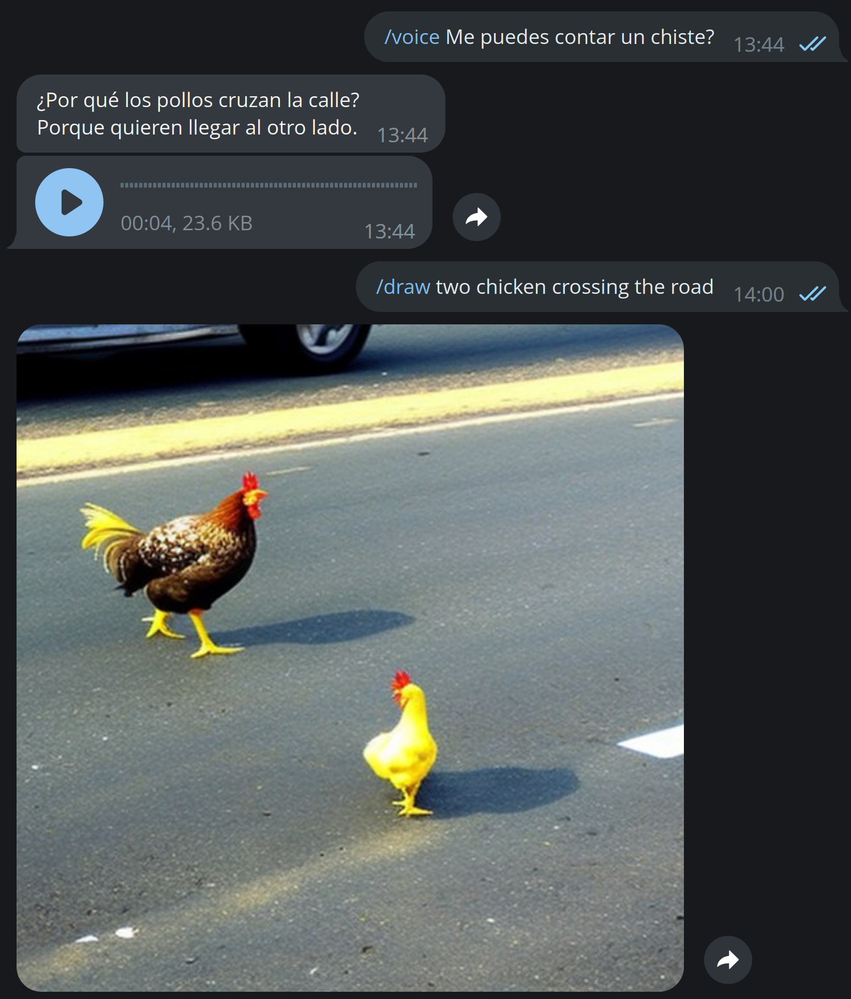

# chatgpt-telegram-bot

[🌐 English instructions below](#english)

Este es un script de Python que permite a un usuario enviar mensajes a un bot de Telegram y recibir respuestas generadas utilizando la API de ChatGPT. También permite a los usuarios generar imágenes utilizando la API de stability.ia y obtener una transcripción de la respuesta de ChatGPT en formato de nota de voz generada por Amazon Polly.



## Requisitos

Para utilizar este script, necesitarás:

* Una cuenta de OpenAI (opcionalmente una [clave de API](https://beta.openai.com/account/api-keys))
* Un bot de Telegram y un [token de autenticación](https://core.telegram.org/bots#how-do-i-create-a-bot)
* (Opcional) Una cuenta de Amazon Web Services y [credenciales de acceso](https://us-east-1.console.aws.amazon.com/iam/home?region=us-east-1#/security_credentials)
* (Opcional) Una cuenta en stability.ai y [credenciales de acceso](https://beta.dreamstudio.ai/membership?tab=apiKeys)

Todos estos servicios dan créditos gratuitos de inicio, a Diciembre de 2022, estos son los costes de sus APIs:

- ChatGPT web: Gratis
- OpenIA API: 0,004$/petición
- Stability IA: 0,002$/petición (con 30 steps)
- Amazon Polly: Aprox. 0,0125$/minuto de audio

## Instalación

Para instalar las dependencias necesarias para ejecutar este script en Python, se puede utilizar el administrador de paquetes pip.

Primero, asegúrate de tener pip instalado en tu sistema. Puedes verificar si ya lo tienes ejecutando el siguiente comando en una terminal:


```
pip --version
```


Si no tienes pip instalado, puedes instalarlo siguiendo las instrucciones en [la página oficial de pip](https://pip.pypa.io/en/stable/installation/)


Para instalar las dependencias, ejecuta el siguiente comando en una terminal en el mismo directorio que el archivo `requirements.txt`:


```
pip install -r requirements.txt
```


Esto instalará todos los paquetes necesarios en tu sistema. Una vez que se hayan instalado, podrás ejecutar el script sin problemas.

## Configuración

Antes de ejecutar el script, necesitarás configurar las credenciales de acceso para OpenAI, AWS, Telegram y stability.ai. Para hacerlo, renombra el archivo llamado `config.py.sample` en el mismo directorio que el script Python a `config.py` y rellena las variables con tus credenciales de acceso.

***Importante***: EL 12/12/22 el modo web dejó de funcionar ([detalles técnicos](https://github.com/acheong08/ChatGPT/issues/273))

Se puede conectar mediante web o api a OpenIA, se controla por la siguiente configuración:

```
openai_mode = "web"
```

El modo web va más lento, pero solo necesitas tu usuario y contraseña, recuerda las conversaciones (a menos que ejecutes /resetchat) y de momento no tiene coste asociado.

## Ejecución

Para ejecutar el script, asegúrate de estar en el mismo directorio que el archivo `chatgpt-telegram.py` y ejecuta el siguiente comando en una terminal:

```
python chatgpt-telegram.py
```

Esto iniciará el bot de Telegram. Una vez que esté en ejecución, puedes enviarle mensajes utilizando la aplicación de Telegram.

El bot acepta los siguientes comandos:

- `/chatgpt`: Enviar un mensaje al bot para que genere una respuesta utilizando la API de ChatGPT
- `/draw`: Dibujar una imagen utilizando el API de stability.ia
- `/voice`: Devuelve la respuesta de ChatGPT, pero adjunta una transcripción como nota de voz generada por Amazon Polly
- `/resetchat`: En el modo openai_mode='web' permite reiniciar la conversación para que no recuerde nada de lo anterior

El bot puede ser también incluido en grupos, pero solo responderá a los usuarios autorizados que hayas configurado. Ten cuidado dando acceso a otras personas ya que el bot estará usando tus APIs de los servicios y estas suelen tener un coste.

Puedes parar el script en cualquier momento pulsando Ctrl+D

## Configurar el bot como un servicio en tu servidor Linux

Para configurar el script ``chatgpt-telegram.py`` como un servicio en un servidor Linux, puedes seguir los siguientes pasos:

***Nota:*** Las siguientes instrucciones están optimizadas para un servidor Ubuntu Linux, pueden ser diferentes para otras distribuciones.

1. Crea un archivo de configuración para el servicio en el directorio ``/etc/systemd/system``. Puedes hacerlo con el comando ``sudo nano /etc/systemd/system/chatgpt-telegram.service``.
2. Agrega el siguiente contenido al archivo, reemplazando <RUTA_DEL_SCRIPT> con la ruta completa del script ``chatgpt-telegram.py`` en tu servidor:

```
[Unit]
Description=ChatGPT Telegram Bot Service

[Service]
Type=simple
WorkingDirectory=<RUTA_DEL_SCRIPT>
ExecStart=<RUTA_DEL_SCRIPT>/chatgpt-telegram.py
Restart=on-failure

[Install]
WantedBy=multi-user.target
```

3. Guarda y cierra el archivo.
4. Haz que el sistema operativo cargue la configuración del nuevo servicio con el comando ``sudo systemctl daemon-reload``.
5. Inicia el servicio con el comando ``sudo systemctl start chatgpt-telegram``.
6. Opcionalmente, puedes habilitar el servicio para que se inicie automáticamente cada vez que se inicie el servidor con el comando ``sudo systemctl enable chatgpt-telegram``.

Una vez que hayas seguido estos pasos, el script ``chatgpt-telegram.py`` se ejecutará como un servicio en tu servidor. Puedes verificar el estado del servicio con el comando ``sudo systemctl status chatgpt-telegram``.

# English

This is a Python script that allows a user to send messages to a Telegram bot and receive responses generated using the ChatGPT API. It also allows users to generate images using the stability.ia API and get a transcript of the ChatGPT response in Amazon Polly generated voice memo format.


## Requirements.

To use this script, you will need:

* An OpenAI account (and optionally an [API key](https://beta.openai.com/account/api-keys)).
* A Telegram bot and an [authentication token](https://core.telegram.org/bots#how-do-i-create-a-bot)
* (Optional) An Amazon Web Services account and [login credentials](https://us-east-1.console.aws.amazon.com/iam/home?region=us-east-1#/security_credentials)
* (Optional) A stability.ai account and [login credentials](https://beta.dreamstudio.ai/membership?tab=apiKeys)

All these services give free startup credits, as of December 2022, these are the costs of their APIs:

- ChatGPT web: Free
- OpenIA: $0.004/request.
- Stability IA: 0,002$/request (with 30 steps)
- Amazon Polly: Approx. $0.0125/audio minute

## Installation

To install the dependencies needed to run this Python script, you can use the pip package manager.

First, make sure you have pip installed on your system. You can check if you already have it by running the following command in a terminal:


```
pip --version
```


If you don't have pip installed, you can install it by following the instructions on [the official pip homepage](https://pip.pypa.io/en/stable/installation/)


To install the dependencies, run the following command in a terminal in the same directory as the `requirements.txt` file:


```
pip install -r requirements.txt
```


This will install all the necessary packages on your system. Once they are installed, you will be able to run the script without any problems.

## Configuration

Before running the script, you will need to configure the login credentials for OpenAI, AWS, Telegram and stability.ai. To do this, rename the file named `config.py.sample` in the same directory as the Python script to `config.py` and fill in the variables with your login credentials.

***Important***: On 12/12/22 web mode stopped working ([technical details](https://github.com/acheong08/ChatGPT/issues/273))

It can be connected via web or api to OpenIA, it is controlled by the following configuration:

```
openai_mode = "web"
```

The web mode is slower, but you only need your username and password, it remembers the conversations (unless you run /resetchat) and for the moment it has no associated cost.

## Execution

To run the script, make sure you are in the same directory as the `chatgpt-telegram.py` file and run the following command in a terminal:

```
python chatgpt-telegram.py
```

This will start the Telegram bot. Once it is running, you can send messages to it using the Telegram app.

The bot accepts the following commands:

- `/chatgpt`: Send a message to the bot to generate a response using the ChatGPT API.
- `/draw`: Draw an image using the stability.ia API
- `/voice`: Return the ChatGPT response, but attach a transcript as a voice memo generated by Amazon Polly.
- `/resetchat`: In openai_mode='web' mode allows you to restart the conversation so that it does not remember anything of the previous one.

The bot can also be included in groups, but will only respond to authorized users that you have configured. Be careful giving access to other people as the bot will be using your services APIs and these usually come at a cost.

You can stop the script at any time by pressing Ctrl+D

## Configuring the bot as a service on your Linux server

To configure the ``chatgpt-telegram.py`` script as a service on a Linux server, you can follow the steps below:

***Note:*** The following instructions are optimized for an Ubuntu Linux server, they may be different for other distributions.

Create a configuration file for the service in the ``/etc/systemd/system`` directory. You can do this with the command ``sudo nano /etc/systemd/system/chatgpt-telegram.service``.
2. Add the following content to the file, replacing <SCRIPT_PATH> with the full path to the ``chatgpt-telegram.py`` script on your server:

```
[Unit]
Description=ChatGPT Telegram Bot Service

[Service]
Type=simple
WorkingDirectory=<RUTA_DEL_SCRIPT>
ExecStart=<RUTA_DEL_SCRIPT>/chatgpt-telegram.py
Restart=on-failure

[Install]
WantedBy=multi-user.target
```

3. Save and close the file.
4. Have the operating system load the new service configuration with the command ``sudo systemctl daemon-reload``.
5. Start the service with the command ``sudo systemctl start chatgpt-telegram``.
6. Optionally, you can enable the service to start automatically every time the server starts with the command ``sudo systemctl enable chatgpt-telegram``.

Once you have followed these steps, the ``chatgpt-telegram.py`` script will run as a service on your server. You can check the status of the service with the command ``sudo systemctl status chatgpt-telegram``.
